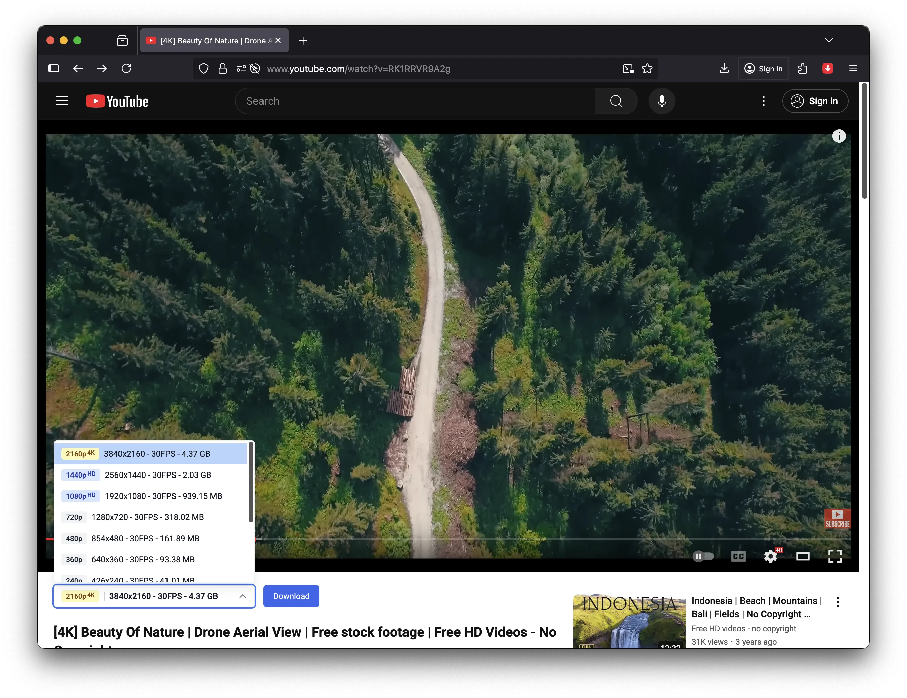
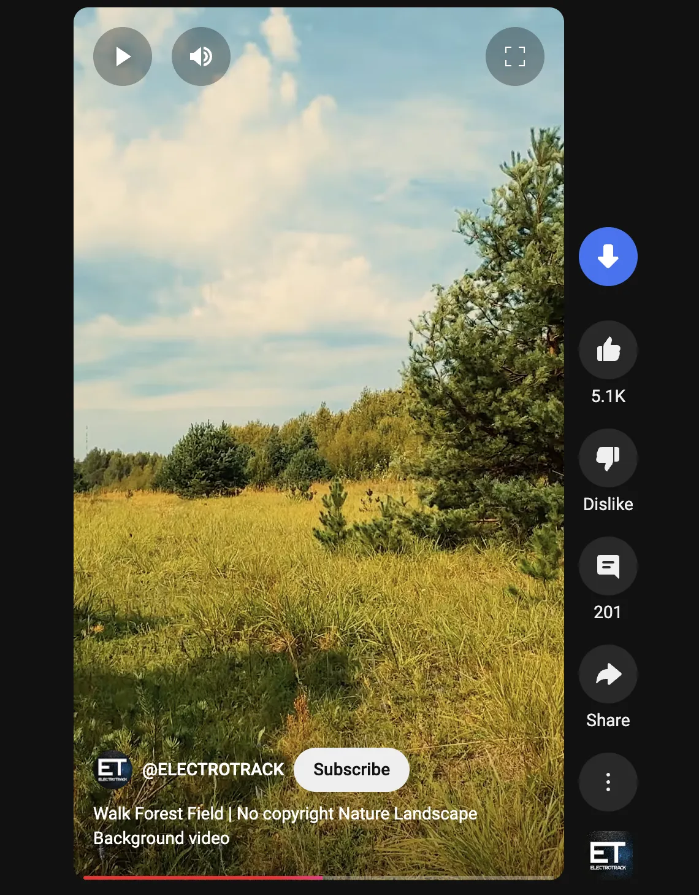

# YouTube Downloader Firefox Add-on - Tubly Downloader

  

<h3 align="center">Download YouTube videos in 4K, convert to MP3, and save YouTube Shorts</h3>

  

  <a href="https://github.com/tublydownloader/Firefox-Youtube-Downloader/issues/new/choose">🐛 Report Issue</a> •
  <a href="https://tubly.download">🌐 Official Website</a>

  <a href="#key-features">Key Features</a> •
  <a href="#screenshots">Screenshots</a> •
  <a href="#installation">Installation</a> •
  <a href="#faq">FAQ</a>

## Key Features

- **4K Video Downloads**: Download YouTube videos in ultra HD quality
- **YouTube to MP3 Converter**: Convert YouTube videos to high-quality 320kbps MP3 audio
- **YouTube Shorts**: Save Shorts videos with one click
- **No Ads, No Extra Software**: Clean and straightforward downloading experience
- **Private Video Support**: Download private videos and member-only content you have access to
- **Firefox Optimized**: Specially designed for Firefox on Windows, macOS, and Linux

## Screenshots

  <video src="screenshots/demo.webm" width="600" alt="YouTube Downloader demo video">

  

  

## Installation

1. **Download the .xpi file**: [Download YouTube Downloader for Firefox](https://github.com/tublydownloader/Firefox-Youtube-Downloader/releases/latest/download/youtube-downloader-firefox.xpi)
2. **Click to install**: Firefox will automatically prompt you to install the add-on
3. **Confirm installation**: Click "Add" when Firefox asks for permission
4. **Start downloading**: Navigate to any YouTube video and start downloading!

## FAQ

### How does this compare to Easy Youtube Video Downloader?
Easy Youtube Video Downloader is a popular add-on for downloading YouTube videos that many users trust. While both add-ons serve the same core purpose, there are some key differences:

- **Video Quality**: Easy Youtube Video Downloader supports up to 1080p, while Tubly Downloader add-on handles 4K and even 8K when available
- **MP3 Conversion**: Tubly Downloader provides one-click MP3 conversion directly from the download interface
- **User Experience**: We focus on modern, intuitive design with reliable download performance

### How do I download YouTube videos in 4K quality?
Simply navigate to any YouTube video, and click the download button that appears below the video player. You'll be presented with multiple quality options, including 4K (2160p) and even 8K if available.

### Can I download YouTube Shorts videos?
Yes! Our Firefox add-on is specially designed to detect and download YouTube Shorts. When viewing Shorts content, you'll see our download button appear, allowing you to save these short-form videos directly to your device.

### How to convert YouTube videos to MP3?
Our Firefox add-on extracts audio directly from YouTube videos without requiring any additional software. After installing, you'll see an "Audio" option when clicking the download button to save in high-quality 320kbps MP3 format.

### Is there a version for Chrome, Edge, or other browsers?
Yes! For Chrome, Edge, Opera, Brave, and Vivaldi users, please visit our [website](https://tubly.download) or [Chrome Extension Repository](https://github.com/tublydownloader/Youtube-Downloader-Extension) for more information.
